# LangChain Memory Components - Visual Diagrams & Concepts

## 🧠 Memory Architecture Overview

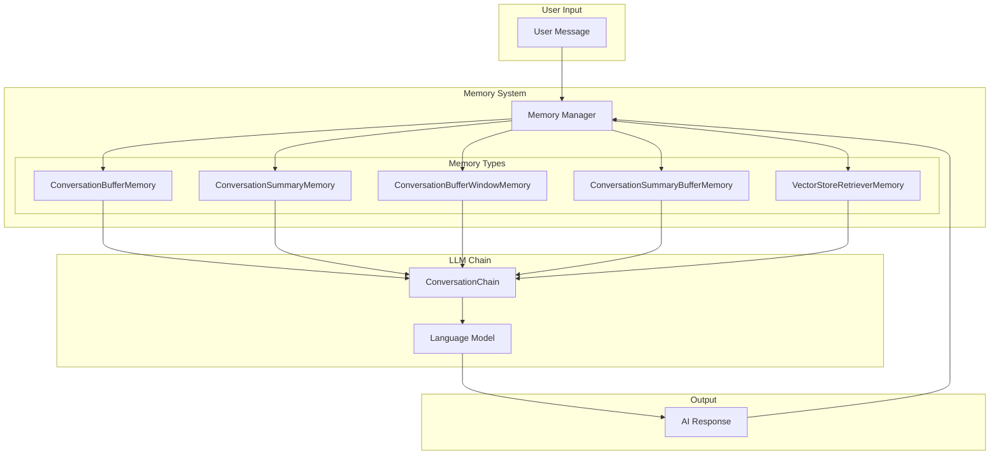

## 📊 Memory Types Comparison

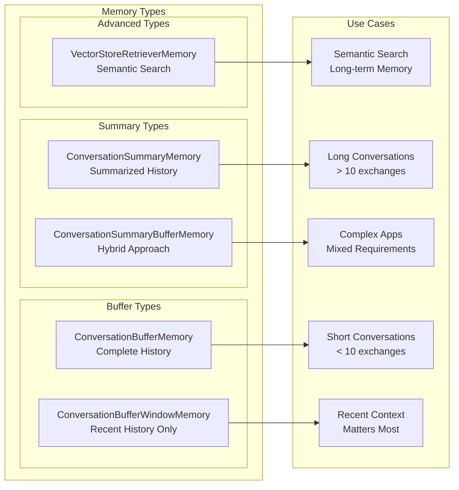

## 🔄 Memory Lifecycle

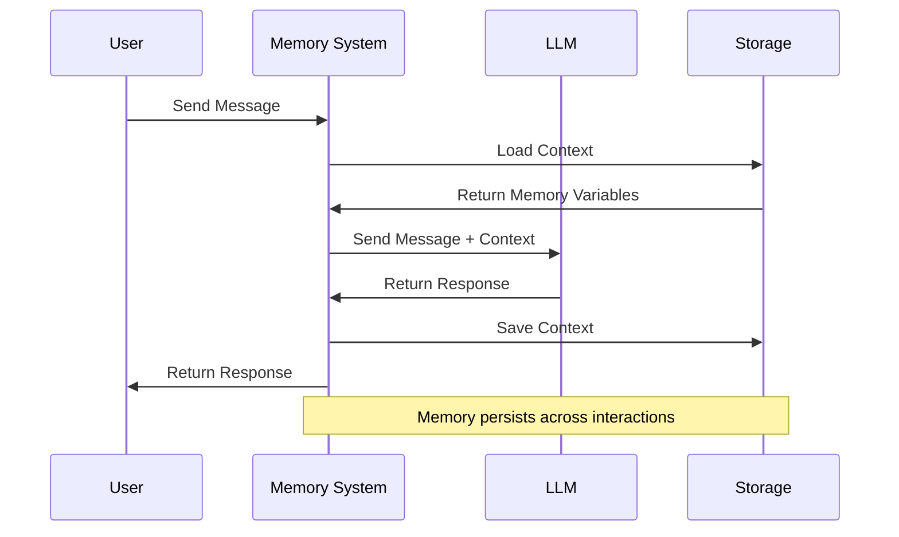

## 📈 Token Management Flow

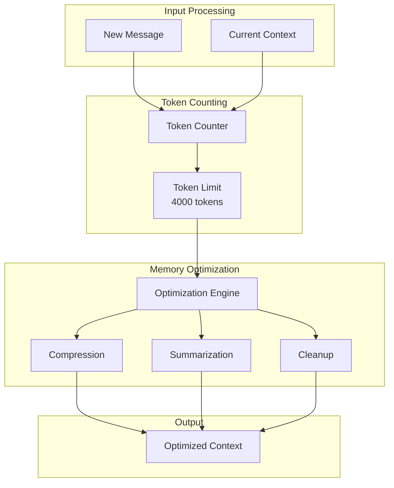

## 🏗️ Memory Implementation Patterns

### 1. ConversationBufferMemory Flow

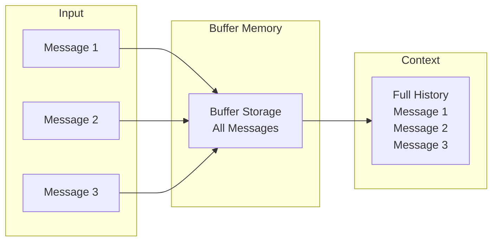

**Characteristics:**
- ✅ Stores complete conversation history
- ✅ Simple and straightforward
- ❌ Can grow very large
- ❌ May hit token limits

### 2. ConversationSummaryMemory Flow

```mermaid
graph LR
    subgraph "Input Messages"
        M1[Message 1]
        M2[Message 2]
        M3[Message 3]
        M4[Message 4]
        M5[Message 5]
    end
    
    subgraph "Summary Process"
        SUM[Summary Engine]
        LLM_SUM[LLM Summarization]
    end
    
    subgraph "Output"
        SUMMARY[Running Summary<br/>"User discussed AI topics,<br/>prefers Python, interested<br/>in machine learning"]
    end
    
    M1 --> SUM
    M2 --> SUM
    M3 --> SUM
    M4 --> SUM
    M5 --> SUM
    SUM --> LLM_SUM
    LLM_SUM --> SUMMARY
```

**Characteristics:**
- ✅ Token-efficient
- ✅ Scales well for long conversations
- ✅ Maintains key points
- ❌ Loses exact details
- ❌ Requires LLM for summarization

### 3. ConversationBufferWindowMemory Flow

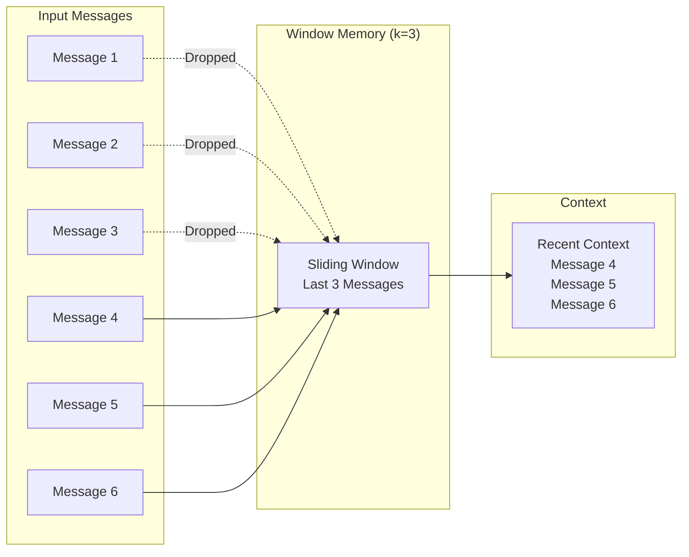

**Characteristics:**
- ✅ Predictable memory size
- ✅ Good for recent context
- ✅ Simple implementation
- ❌ Loses older context
- ❌ Fixed window size

### 4. VectorStoreRetrieverMemory Flow

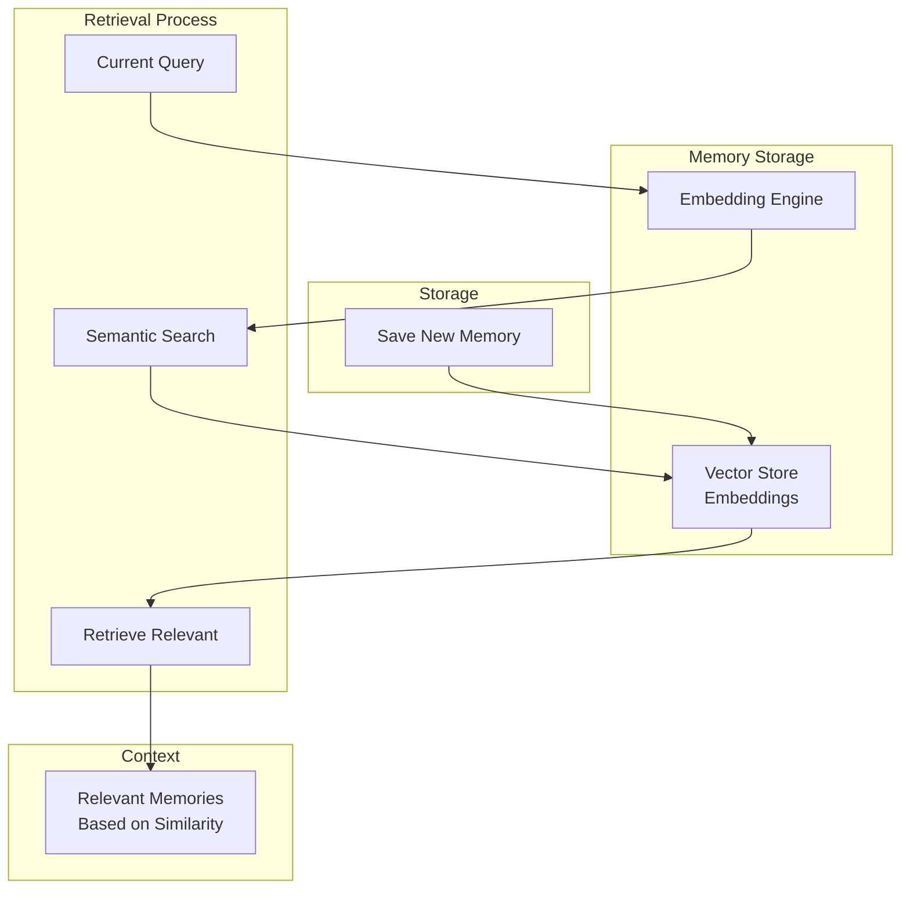

**Characteristics:**
- ✅ Semantic search capabilities
- ✅ Long-term memory
- ✅ Scalable
- ✅ Can find related memories
- ❌ More complex setup
- ❌ Requires embeddings

## 🔧 Custom Memory Implementation

### Multi-User Session Management

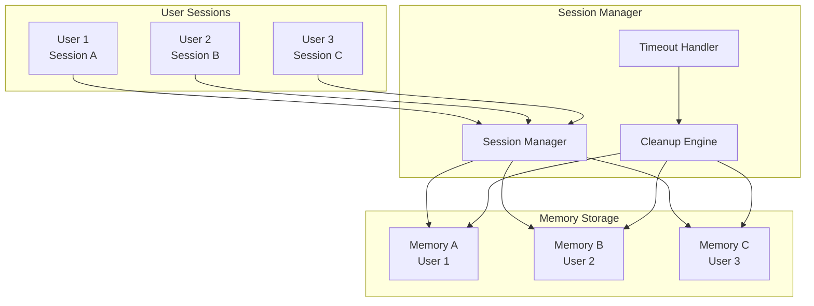

### Memory Composition Pattern

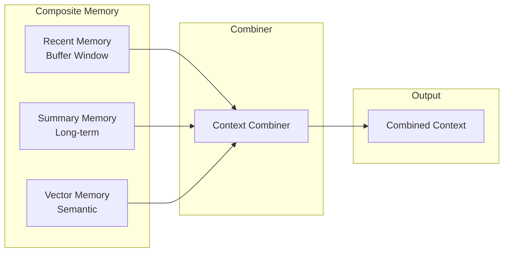

## 📊 Memory Performance Metrics

### Token Usage Over Time

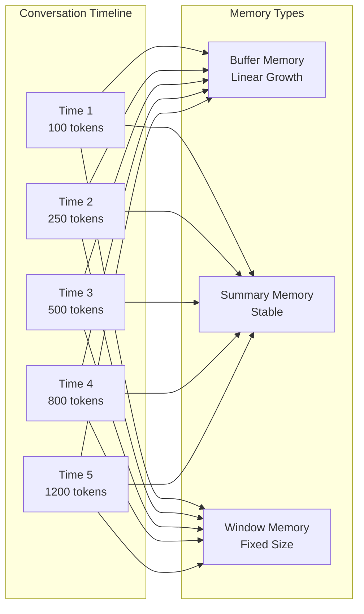

## 🎯 Memory Selection Decision Tree

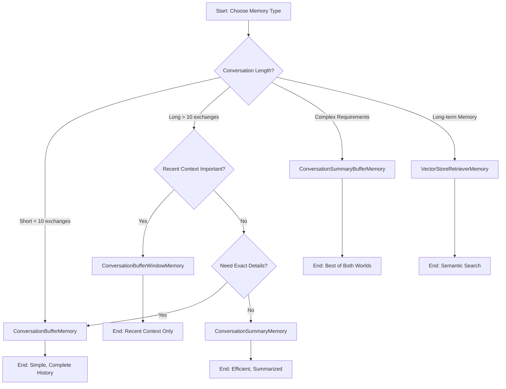

## 🔄 Memory Optimization Strategies

### Compression Flow

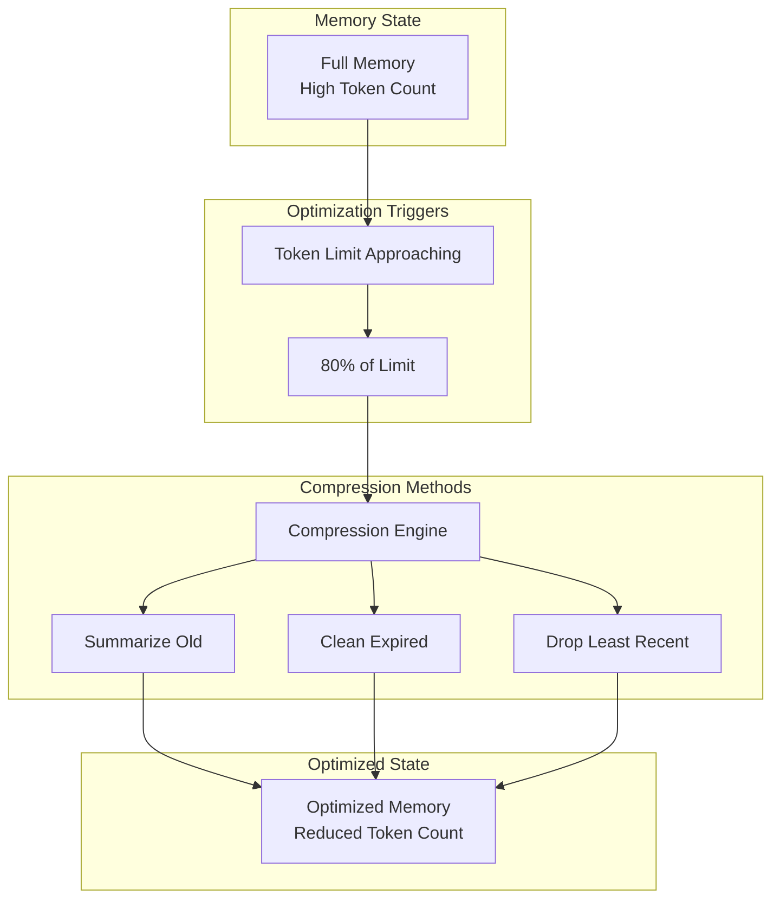

## 🏭 Production Memory Architecture

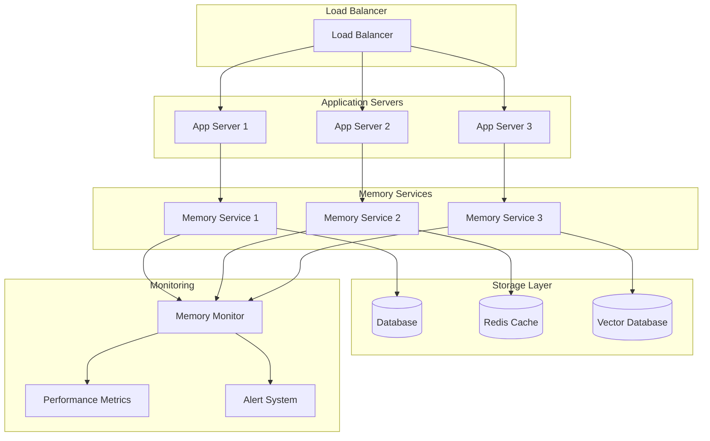

## 📝 Key Concepts Explained

### 1. Memory Variables
Memory variables are the data that gets passed to the LLM to provide context. They can include:
- **chat_history**: Previous conversation messages
- **summary**: Summarized conversation history
- **relevant_memories**: Retrieved from vector store
- **user_preferences**: Stored user information

### 2. Memory Keys
Memory keys are identifiers that help organize different types of stored information:
- **memory_key**: The key used to access memory variables
- **input_key**: The key for user input
- **output_key**: The key for AI output

### 3. Memory Persistence
Memory persistence determines how long and where memory is stored:
- **In-Memory**: Lost when application restarts
- **Database**: Persistent across restarts
- **File System**: Simple persistence
- **Vector Store**: For semantic search

### 4. Token Management
Token management is crucial for preventing context overflow:
- **Token Counting**: Estimate tokens in memory
- **Compression**: Summarize or truncate when approaching limits
- **Cleanup**: Remove old or irrelevant memories
- **Optimization**: Balance context retention with token efficiency

## 🎓 Learning Progression

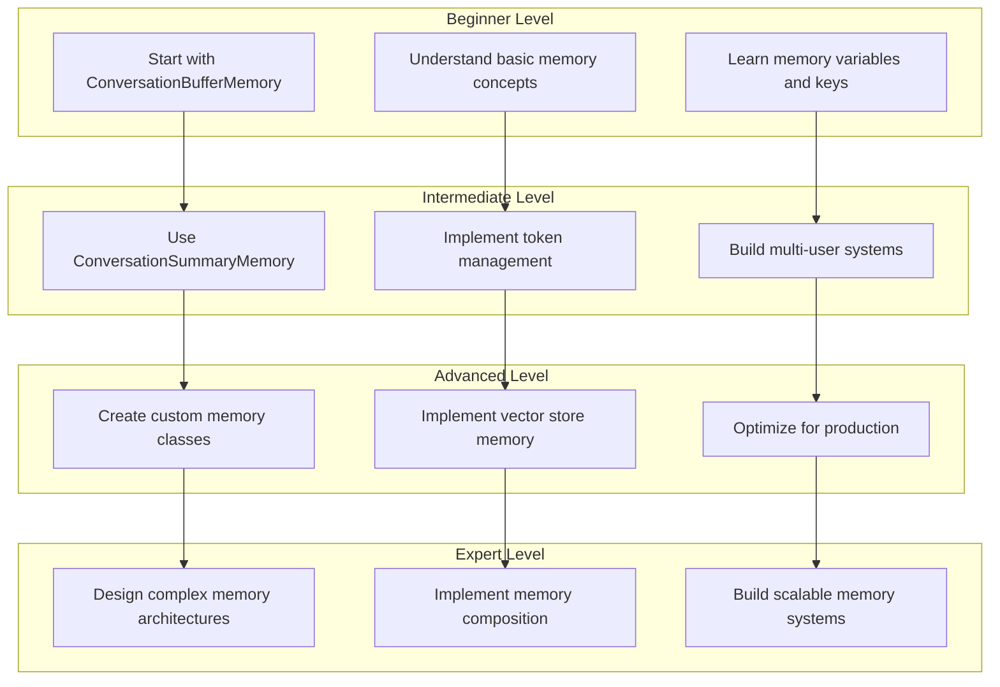

These diagrams provide a comprehensive visual understanding of LangChain memory components, their relationships, and how they work together to create effective conversational AI systems. 