# LangChain Document Processing - Visual Diagrams & Concepts

## 📄 Document Processing Architecture Overview

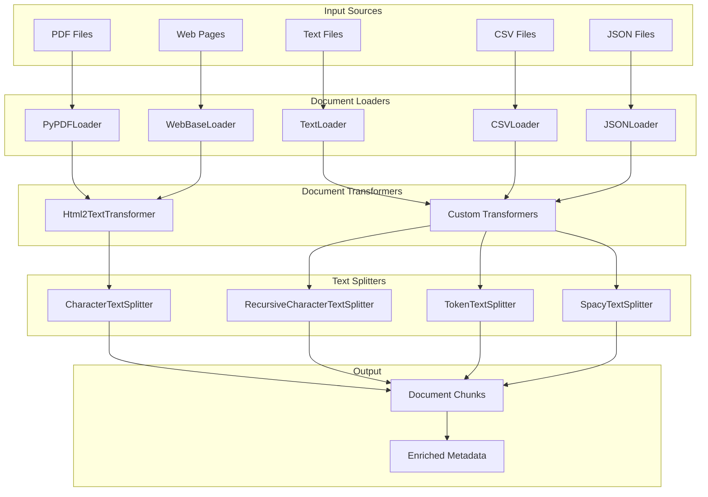

## 🔄 Document Processing Pipeline

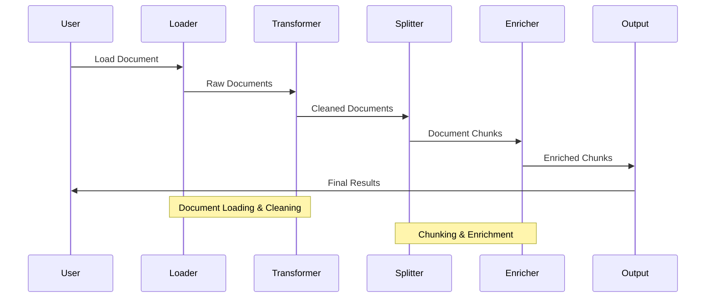

## 📊 Document Loaders Comparison

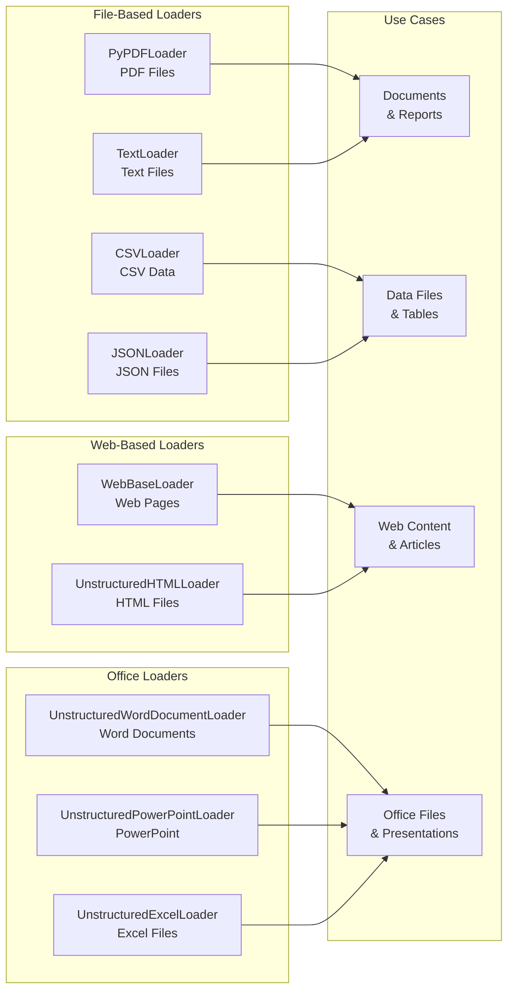

## ✂️ Text Splitting Strategies

### 1. Character-Based Splitting

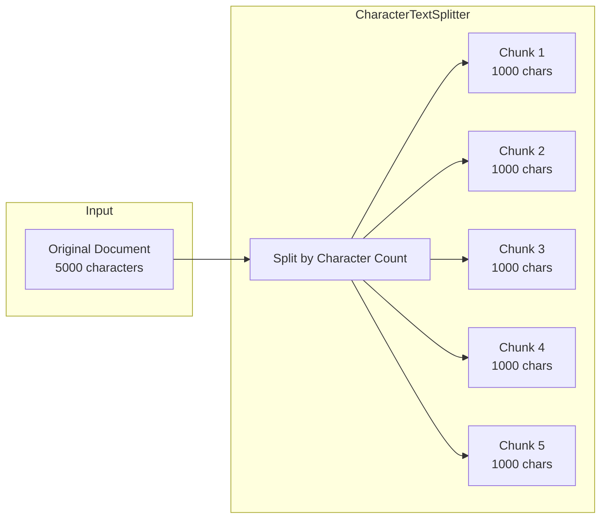

### 2. Recursive Character Splitting

```mermaid
graph LR
    subgraph "Input"
        DOC[Original Document]
    end
    
    subgraph "RecursiveCharacterTextSplitter"
        SEP1[Try "\n\n"]
        SEP2[Try "\n"]
        SEP3[Try " "]
        SEP4[Try ""]
    end
    
    subgraph "Output"
        CHUNK1[Semantic Chunk 1]
        CHUNK2[Semantic Chunk 2]
        CHUNK3[Semantic Chunk 3]
    end
    
    DOC --> SEP1
    SEP1 --> SEP2
    SEP2 --> SEP3
    SEP3 --> SEP4
    SEP4 --> CHUNK1
    SEP4 --> CHUNK2
    SEP4 --> CHUNK3
```

### 3. Token-Aware Splitting

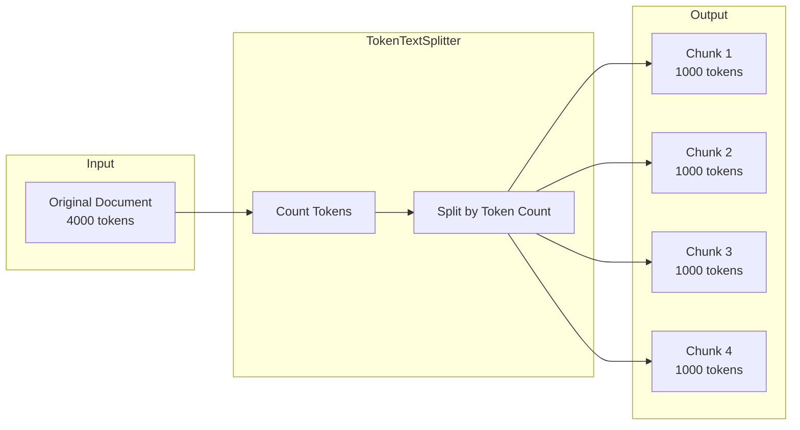

## 🏗️ Processing Pipeline Architecture

### 1. Basic Pipeline

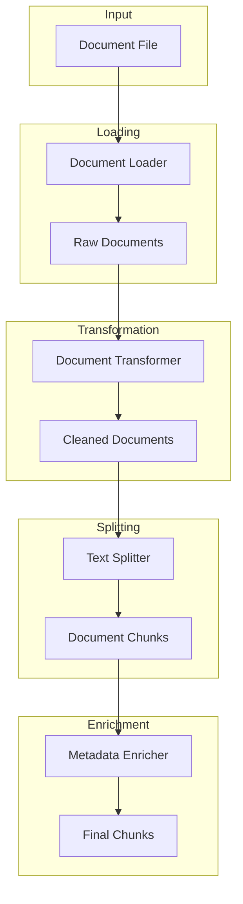

### 2. Multi-Format Pipeline

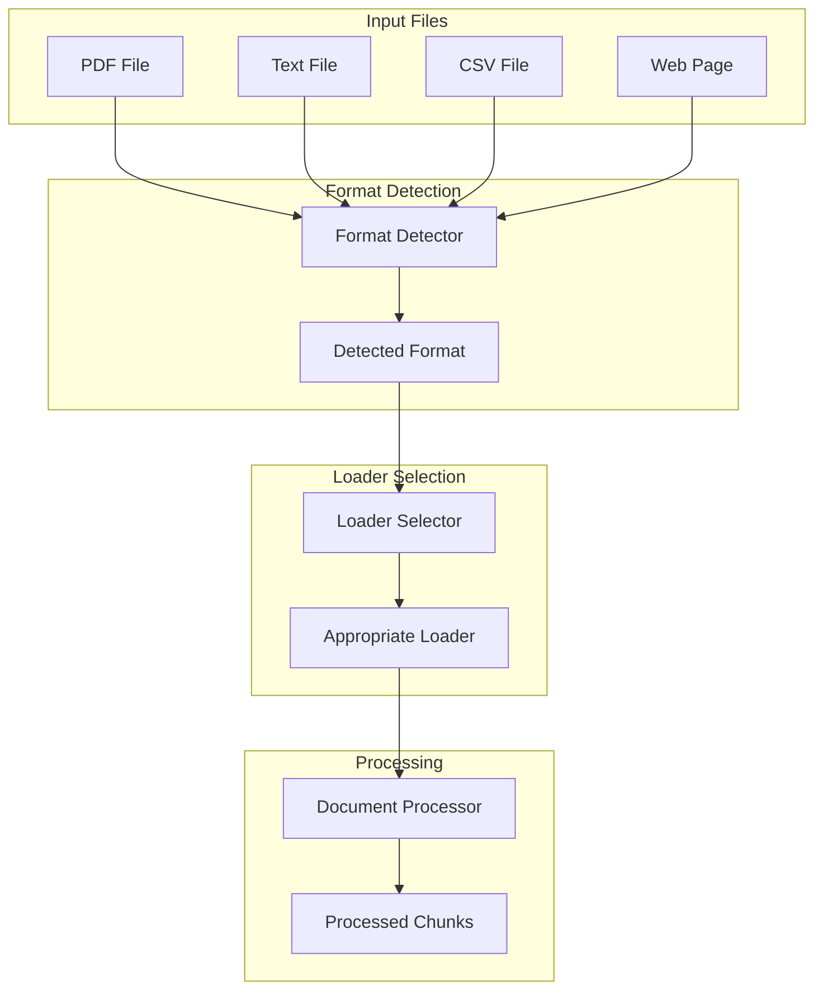

### 3. Batch Processing Pipeline

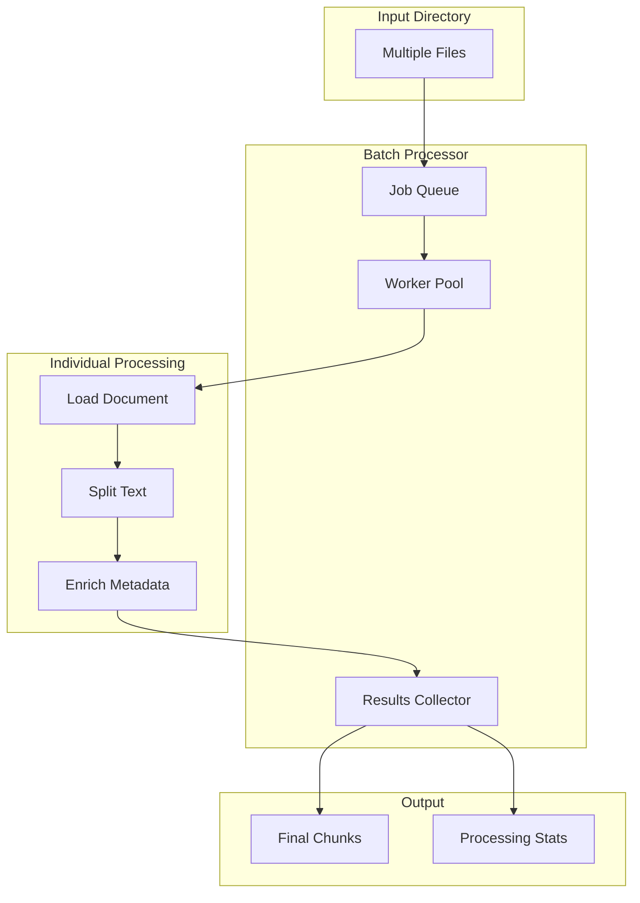

## 📈 Performance Optimization

### 1. Parallel Processing

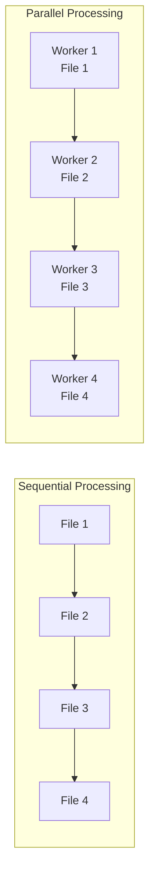

### 2. Memory Management

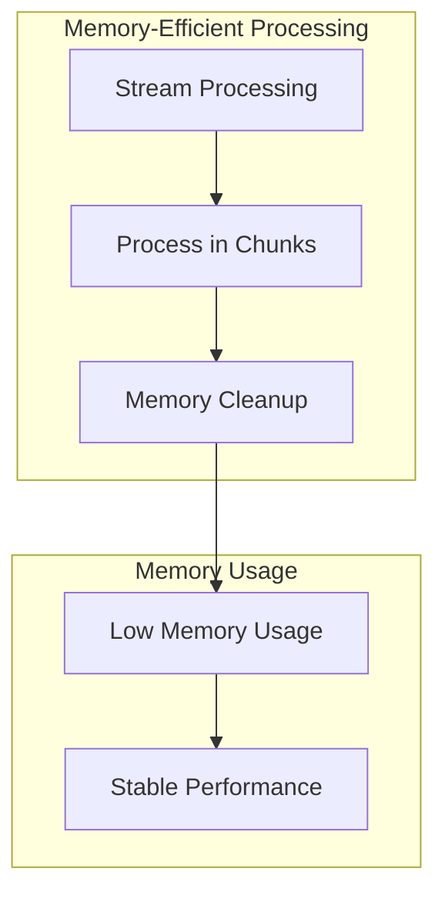

## 🎯 Document Quality Control

### 1. Quality Validation Flow

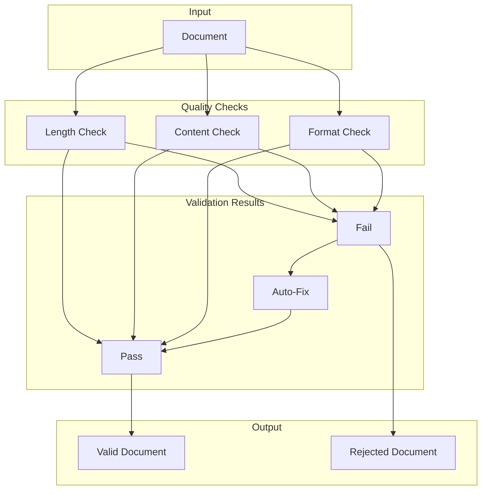

### 2. Quality Metrics

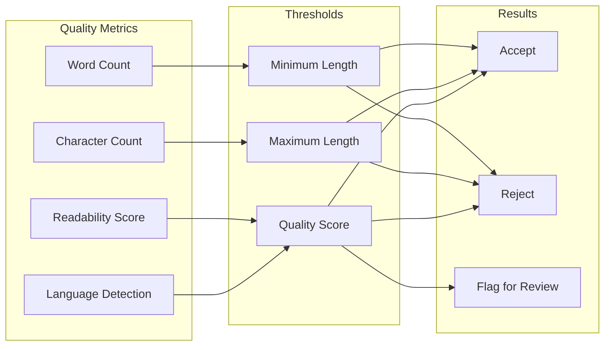

## 🔧 Custom Document Transformers

### 1. Transformer Pipeline

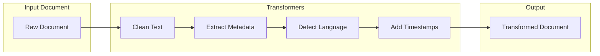

### 2. Metadata Enrichment

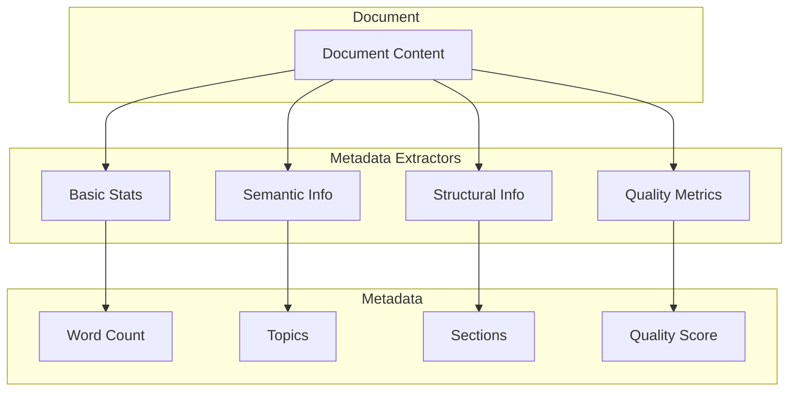

## 📊 Chunk Size Optimization

### 1. Chunk Size vs. Performance

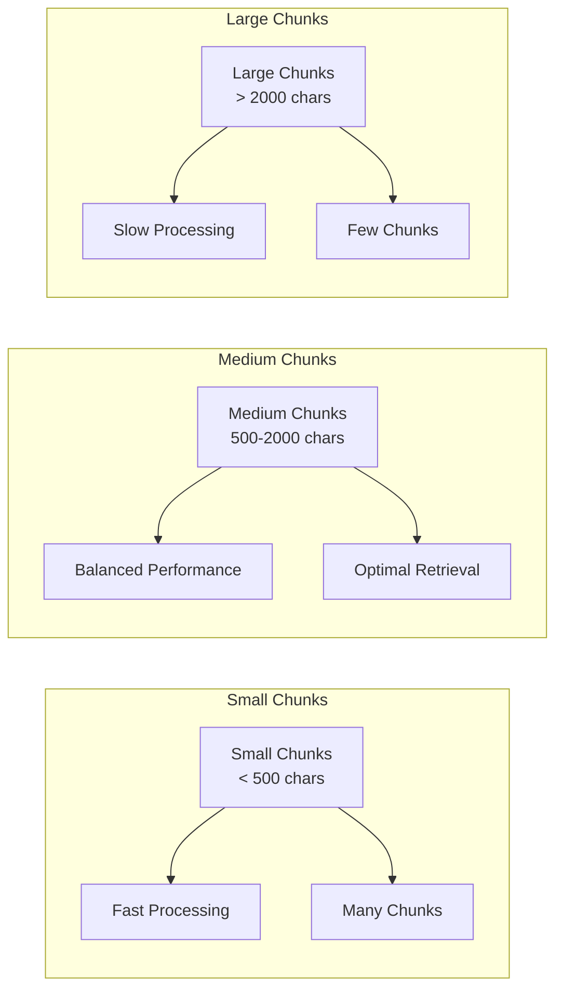

### 2. Overlap Strategy

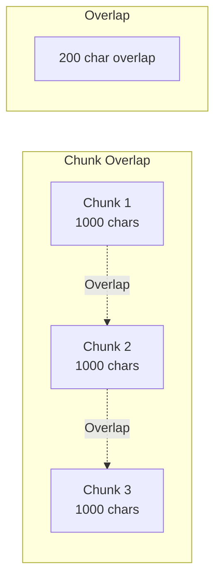

## 🎓 Learning Progression

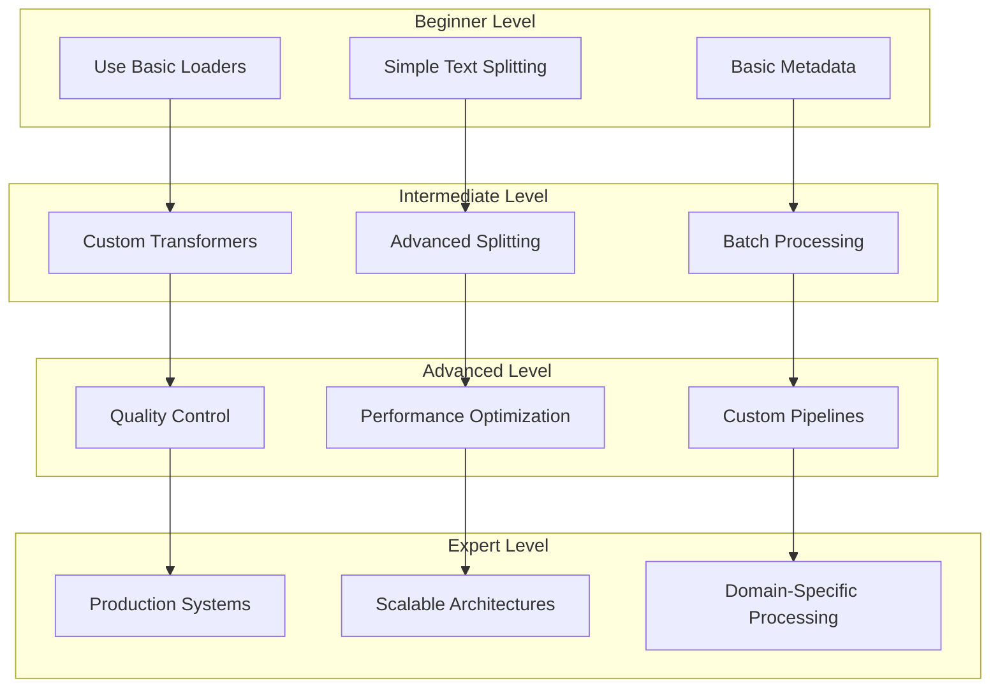

## 📝 Key Concepts Explained

### 1. Document Loaders
Document loaders extract content from various sources:
- **File-based**: PDF, TXT, CSV, JSON files
- **Web-based**: Web pages, HTML content
- **Office-based**: Word, PowerPoint, Excel files
- **Database**: SQL queries, API responses

### 2. Text Splitters
Text splitters break documents into manageable chunks:
- **Character-based**: Simple character count splitting
- **Recursive**: Preserves semantic boundaries
- **Token-aware**: Respects LLM token limits
- **Structure-aware**: Preserves document structure

### 3. Document Transformers
Document transformers clean and enrich content:
- **HTML to Text**: Convert web content to clean text
- **Custom Transformers**: Domain-specific processing
- **Metadata Extraction**: Add rich metadata
- **Quality Control**: Validate and filter documents

### 4. Processing Pipelines
Processing pipelines combine multiple steps:
- **Loading**: Extract content from sources
- **Transformation**: Clean and enrich content
- **Splitting**: Break into appropriate chunks
- **Enrichment**: Add metadata and context

## 🎯 Best Practices Visualization

### 1. Chunk Size Selection

```
┌─────────────────────────────────────┐
│ Chunk Size Guidelines              │
├─────────────────────────────────────┤
│ Short chunks (< 500 chars):        │
│ - Fast processing                   │
│ - Many small chunks                 │
│ - Good for simple queries           │
│                                     │
│ Medium chunks (500-2000 chars):    │
│ - Balanced performance              │
│ - Optimal for most use cases       │
│ - Good context preservation         │
│                                     │
│ Large chunks (> 2000 chars):       │
│ - Slower processing                 │
│ - Fewer chunks                     │
│ - Good for complex queries          │
└─────────────────────────────────────┘
```

### 2. Error Handling Strategy

```
┌─────────────────────────────────────┐
│ Error Handling Flow                │
├─────────────────────────────────────┤
│ 1. Try to load document            │
│ 2. If format not supported:        │
│    - Log error                     │
│    - Skip document                 │
│    - Continue with next            │
│ 3. If loading fails:               │
│    - Retry with different loader   │
│    - Use fallback strategy         │
│ 4. If processing fails:            │
│    - Log error details             │
│    - Return partial results        │
└─────────────────────────────────────┘
```

These diagrams provide a comprehensive visual understanding of LangChain document processing components, their relationships, and how they work together to create effective document processing systems. 