# LangChain Vector Stores - Visual Diagrams & Concepts

## 🔍 Vector Database vs Traditional Database

### Traditional Database Architecture


### Vector Database Architecture

```mermaid
graph TB
    subgraph "Vector Database"
        subgraph "Data Structure"
            EMBEDDINGS[Embeddings Space]
            VECTOR1[Vector 1: [0.23, -0.45, 0.67, ...]]
            VECTOR2[Vector 2: [0.25, -0.43, 0.65, ...]]
            VECTOR3[Vector 3: [0.18, -0.52, 0.71, ...]]
        end
        
        subgraph "Query Process"
            QUERY_V[Query: "machine learning"]
            EMBED_QUERY[Embed Query]
            SIMILARITY[Similarity Search]
            RESULT_V[Results: Similar vectors]
        end
        
        subgraph "Search Type"
            SEMANTIC[Semantic Search]
            SIMILARITY_SEARCH[Similarity-based]
            MEANING[Meaning-based]
        end
    end
    
    QUERY_V --> EMBED_QUERY
    EMBED_QUERY --> SIMILARITY
    SIMILARITY --> RESULT_V
    EMBEDDINGS --> VECTOR1
    EMBEDDINGS --> VECTOR2
    EMBEDDINGS --> VECTOR3
```

## 🧠 Embedding Process Flow

### Text to Vector Conversion

```mermaid
graph LR
    subgraph "Input"
        TEXT[Text: "Machine learning is fascinating"]
    end
    
    subgraph "Embedding Model"
        MODEL[Embedding Model<br/>OpenAI text-embedding-3-small]
        PROCESS[Process Text]
        VECTOR[Generate Vector]
    end
    
    subgraph "Output"
        EMBEDDING[Embedding: [0.23, -0.45, 0.67, ..., 0.12]]
        DIMENSIONS[1536 Dimensions]
    end
    
    TEXT --> MODEL
    MODEL --> PROCESS
    PROCESS --> VECTOR
    VECTOR --> EMBEDDING
    EMBEDDING --> DIMENSIONS
```

### Similarity Calculation

```mermaid
graph TB
    subgraph "Vector Space"
        V1[Vector A: [0.2, 0.3, 0.1, ...]]
        V2[Vector B: [0.21, 0.29, 0.12, ...]]
        V3[Vector C: [0.8, 0.1, 0.9, ...]]
    end
    
    subgraph "Distance Metrics"
        COSINE[Cosine Similarity]
        EUCLIDEAN[Euclidean Distance]
        DOT_PRODUCT[Dot Product]
    end
    
    subgraph "Results"
        SIMILAR[Similar Vectors]
        DIFFERENT[Different Vectors]
    end
    
    V1 --> COSINE
    V2 --> COSINE
    V3 --> COSINE
    
    COSINE --> SIMILAR
    COSINE --> DIFFERENT
```

## 📚 Vector Store Types Comparison

### Local vs Cloud Vector Stores


### Vector Store Features Comparison

```mermaid
graph TB
    subgraph "Chroma"
        C_PERSIST[Persistence ✅]
        C_METADATA[Metadata Filtering ✅]
        C_SETUP[Easy Setup ✅]
        C_SCALE[Medium Scale]
    end
    
    subgraph "FAISS"
        F_PERSIST[Manual Persistence]
        F_METADATA[Limited Metadata]
        F_SETUP[Medium Setup]
        F_SCALE[High Scale ✅]
    end
    
    subgraph "Pinecone"
        P_PERSIST[Cloud Persistence ✅]
        P_METADATA[Advanced Metadata ✅]
        P_SETUP[Easy Setup ✅]
        P_SCALE[High Scale ✅]
    end
    
    subgraph "Weaviate"
        W_PERSIST[Graph Persistence ✅]
        W_METADATA[Complex Metadata ✅]
        W_SETUP[Complex Setup]
        W_SCALE[High Scale ✅]
    end
```



## 🔍 Search Operations Flow

### Basic Similarity Search


### Metadata Filtering Search

```mermaid
graph TB
    subgraph "Query"
        QUERY[Query: "neural networks"]
        METADATA[Metadata Filter:<br/>source: research<br/>year: >= 2020]
    end
    
    subgraph "Vector Store"
        VECTOR_SEARCH[Vector Similarity Search]
        METADATA_FILTER[Metadata Filtering]
        COMBINE[Combine Results]
    end
    
    subgraph "Results"
        FILTERED[Filtered Results]
        SCORES[Similarity Scores]
    end
    
    QUERY --> VECTOR_SEARCH
    METADATA --> METADATA_FILTER
    VECTOR_SEARCH --> COMBINE
    METADATA_FILTER --> COMBINE
    COMBINE --> FILTERED
    COMBINE --> SCORES
```

### Hybrid Search (Semantic + Keyword)

```mermaid
graph TB
    subgraph "Input"
        QUERY[Query: "machine learning algorithms"]
    end
    
    subgraph "Search Methods"
        SEMANTIC[Semantic Search<br/>Vector Similarity]
        KEYWORD[Keyword Search<br/>Text Matching]
    end
    
    subgraph "Fusion"
        FUSE[Result Fusion<br/>Alpha = 0.7]
        RANK[Re-ranking]
    end
    
    subgraph "Output"
        FINAL[Final Results]
        SCORES[Combined Scores]
    end
    
    QUERY --> SEMANTIC
    QUERY --> KEYWORD
    SEMANTIC --> FUSE
    KEYWORD --> FUSE
    FUSE --> RANK
    RANK --> FINAL
    RANK --> SCORES
```

## 🏗️ Vector Store Architecture Patterns

### Multi-Vector Store Architecture


### Real-time Vector Updates


## 📊 Performance Optimization

### Vector Store Performance Comparison


### Embedding Model Performance


## 🔧 Production Architecture

### Scalable Vector Search System


### Vector Store Monitoring


## 🎯 Key Concepts Explained

### 1. Vector Embeddings
Vector embeddings are numerical representations of text in high-dimensional space:
- **Dimensionality**: Number of values in the vector (e.g., 1536 for OpenAI)
- **Semantic Similarity**: Similar concepts have similar vectors
- **Distance Metrics**: Cosine, Euclidean, Dot Product for similarity calculation
- **Normalization**: Vectors are often normalized for consistent comparison

### 2. Vector Stores vs Traditional Databases

| **Aspect** | **Traditional Database** | **Vector Database** |
|------------|-------------------------|---------------------|
| **Search Type** | Exact match, keyword-based | Semantic similarity |
| **Data Structure** | Tables, rows, columns | High-dimensional vectors |
| **Query Performance** | Fast for exact matches | Optimized for similarity search |
| **Use Cases** | CRUD operations, transactions | AI/ML applications, semantic search |
| **Scalability** | Horizontal scaling | Vector-specific optimizations |
| **Storage** | Structured data | Embeddings + metadata |

### 3. Search Operations
Vector stores support various search operations:
- **Similarity Search**: Find most similar vectors to a query
- **Metadata Filtering**: Filter results based on document metadata
- **Hybrid Search**: Combine semantic and keyword search
- **Batch Operations**: Process multiple queries efficiently

### 4. Performance Optimization
Key optimization strategies:
- **Index Optimization**: Use appropriate indexing for your use case
- **Caching**: Cache frequently accessed embeddings and results
- **Compression**: Compress vectors to reduce storage and improve speed
- **Distributed Search**: Use multiple vector stores for large datasets

## 🎓 Learning Progression


These diagrams provide a comprehensive visual understanding of LangChain vector stores, their architecture, and how they compare to traditional databases. The visual representations help students understand the concepts more effectively than text alone. 